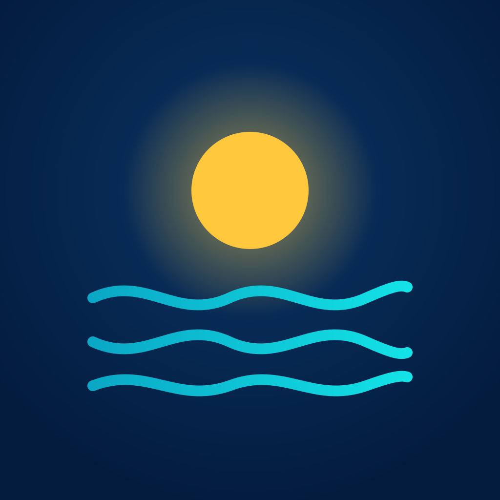

  

<h1 align="center">Noor+ / ނޫރް+</h1>

  Prayer times, Qibla direction, and the Hijri calendar - built for every island in the Maldives.

---

Noor+ is a free, open-source prayer companion built specifically for the
Maldives. Instead of estimating prayer times from a generic calculation
method, it uses the officially published times for each individual island,
so what you see matches what your local mosque uses - whether you're in
Malé, a resort island, or a small island far from the capital.

## Features

**Prayer times for your island**
Pick your island once during setup and get accurate Fajr, Sunrise, Dhuhr,
Asr, Maghrib, and Isha times for every day of the year. The Home screen
shows a live countdown to the next prayer, and you can swipe through
yesterday, tomorrow, or any other day.

**Qibla finder**
A compass screen points you toward the Qibla from wherever you are, using
your phone's compass and location. Your location is only used on your
device to work out the direction - it's never sent anywhere. An optional
vibration confirms the moment you're correctly facing the Qibla.

**Hijri & Gregorian calendar**
Browse a full month view in either the Hijri or Gregorian calendar, with
notable Islamic dates highlighted. Choose which calendar you'd rather see
by default in Settings.

**Prayer notifications**
Get reminded for each of the five daily prayers, with the option to hear
the adhan play with the notification. (If your phone's ring/silent switch
is set to silent, you'll still get the reminder and a vibration - just
without the adhan sound, which is a restriction of the phone's system, not
the app.)

**Home screen widget**
Add a Noor+ widget to your iPhone's home screen or lock screen to see your
next prayer at a glance. It follows the island you've set in the app
automatically, or you can pin a widget to a different island of its own.

**Your language**
Use the app in English, Dhivehi (ދިވެހި), or Arabic, with the Dhivehi and
Arabic interfaces laid out properly for their own scripts and reading
direction.

**Private by design**
No account, no sign-up, and no analytics. Everything - your chosen island,
language, and notification preferences - stays on your device.

## Design

Noor+ uses a calm "Ocean Night" look - midnight navy, lagoon cyan, and a
touch of sunrise gold - meant to feel at home on an island evening as much
as at Fajr.

## Contributing

Noor+ is open source and contributions are welcome - bug reports, feature
ideas, translation fixes, and pull requests. See
[CONTRIBUTING.md](CONTRIBUTING.md) for how to build and run the project
locally.

## License

Noor+ is released under the [MIT License](LICENSE).
